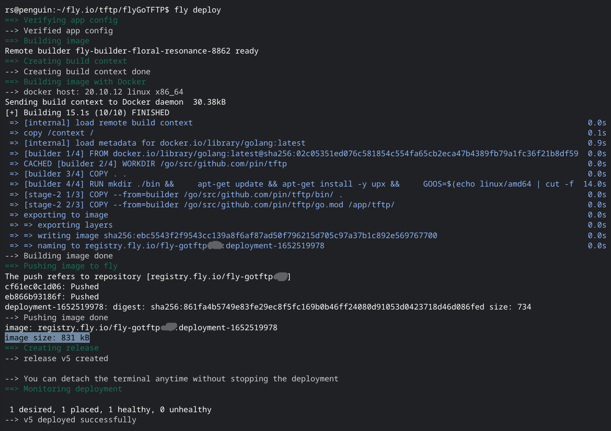
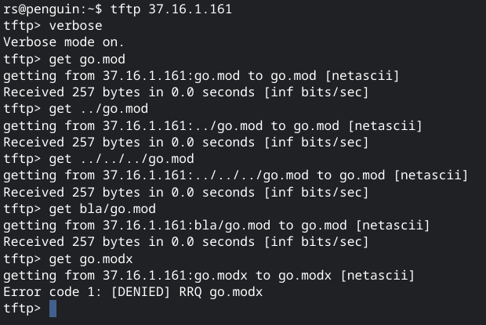
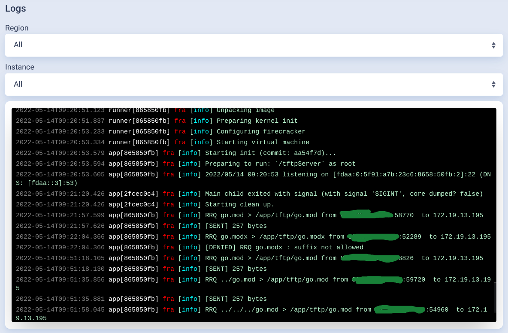

## flyGoTFTP: a minimal "Distroless" read-only TFTP server that runs on Fly.io

This read-only TFTP server builds and runs on Fly.io's IPv4/IPv6 Anycast network. Its Docker image is smaller than 850 kByte (not including the content files served).

This stripped down TFTP server was inspired by the Blog article [Serve Small With Fly.io and GoStatic](https://fly.io/blog/serve-small-with-fly-io-and-gostatic/).
Its `Dockerfile` is almost a 1:1 copy from [PierreZ/goStatic](https://github.com/PierreZ/goStatic/) with some minor adaptations from HTTP/S to TFTP.

The `tftpServer.go` uses the TFTP Go library [pin/tftp](https://github.com/pin/tftp), and the server example code from its [README.md](https://github.com/pin/tftp#tftp-server) with some additions, such as disable writes to the server, filter by file extensions, and prevent any kind of tree traversal attacks (likely, there is not much to gain from within the tiny microVM that runs on Firecracker). The use of the single-port mode option is necessary in order to adapt to the specific environment of Fly.io (no port translation of dynamic high ports, although it impacts file transfer performance.

File transfer is not a big concern in our use case where the TFTP server serves small files to TFTP clients. These are distributed machines use PXE to perform "network boot" over the Internet using PXE, for example to chainload iPXE which is a few kByte only.
More important is the availability and low latencency that is easy to achive on Fly.io with its Anycast network, and by scaling out the number of active & backup TFTP server instances into selected regions world-wide.

Note that `tftpServer.go` supports dual-stack IPv4/IPv6 operation. However, Fly.io supports UDP only over IPv4 at the moment.
Thus make sure that TFTP clients will only connect using IPv4, for example by adding only an A record that points to the Anycast IPv4 address of the server(s) at Fly.io only, but do not add any AAAA record for it in the DNS of your custom domain.
This is different to the static Web server example `goStatic` because HTTP/1.x & HTTP/2 use TCP, and Fly.io supports TCP for both IPv4 and IPv6. This changes with HTTP/3 (QUIC) which usually prefers UDP over TCP.

### ToDo

- Shift local port from priviledged port 69/udp to high port 6969/udp in tftpServer.go, and mapping 69 (publci) -> 6969 (local). This would allow `appuser` instead of `root` to start tftpServer (only `root` can open priviledged low ports).
Although this works in principle (`appuser` can start `tftpServer` which will listen on port 6969/udp), replies from the TFTP server do not make it back to the TFTP clients.
- Improve the transfer performance of files, which appears to be degraded by the single-port mode, for example by increasing the TFTP block size on the client side from default 512 to 4096 or 8192 Byte.

- Test TFTP over IPv6, once Fly supports UDP also on IPv6.
- Add `.tf` files to configure/update DNS records to custom domains that point to the Anycast IP addresses of the FTFP server(s), once a Terraform Provider becomes available for Fly.io.

### References
[1] [Serve Small With Fly.io and GoStatic](https://fly.io/blog/serve-small-with-fly-io-and-gostatic/)

[2] [Going tiny - A 7.7MB server image](https://community.fly.io/t/going-tiny-a-7-7mb-server-image/33)

[3] [Create a static website with Fly](https://github.com/fly-apps/hello-static)

[4] [goStatic: A really small static web server for Docker](https://github.com/firstderm/goStatic)

[5] [A really small static web server for Docker](https://hub.docker.com/r/pierrezemb/gostatic)
Note that "Usage" is somewhat outdated, requires a PR for ex. to replace deprecated `-enable-logging` by `-log-level=debug`. 

[6] [TFTP server and client library for Golang](https://github.com/pin/tftp)

[7] [Running Fly.io Apps On UDP and TCP](https://fly.io/docs/app-guides/udp-and-tcp/)

### Screenshots

Deploy on Fly.io by `fly deploy`:

Memory used by microVM in Firecracker:

TFTP client session:

Log outout on WebUI of Fly.io:

